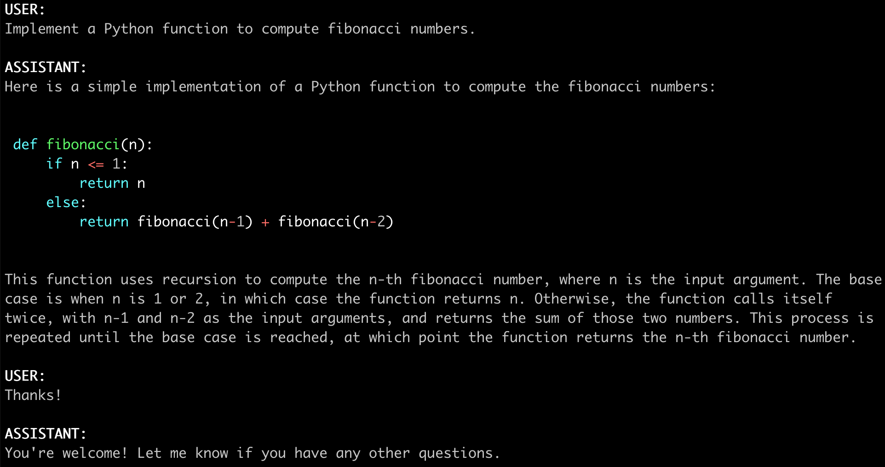

# FastChat

FastChat's core features include:
- The training and evaluation code for state-of-the-art models (e.g., Vicuna, MT-Bench).
- A distributed multi-model serving system with web UI and OpenAI-compatible RESTful APIs.

## Contents
- [Install](#install)
- [Model Weights](#model-weights)
- [Inference with Command Line Interface](#inference-with-command-line-interface)
- [Serving with Web GUI](#serving-with-web-gui)
- [API](#api)
- [Evaluation](#evaluation)
- [Fine-tuning](#fine-tuning)
- [Citation](#citation)

## Install

### Method 1: With pip

```bash
pip3 install "fschat[model_worker,webui]"
```

### Method 2: From source

If you are running on Mac:
```bash
brew install rust cmake
```

2. Install Package
```bash
pip3 install --upgrade pip  # enable PEP 660 support
pip3 install -e ".[model_worker,webui]"
```

## Model Weights

You can use the commands below to start chatting. It will automatically download the weights from Hugging Face repos.
Downloaded weights are stored in a `.cache` folder in the user's home folder (e.g., `~/.cache/huggingface/hub/<model_name>`).

See more command options and how to handle out-of-memory in the "Inference with Command Line Interface" section below.

**NOTE: `transformers>=4.31` is required for 16K versions.**

| Size | Chat Command | Hugging Face Repo |
| ---  | --- | --- |
| 7B   | `python3 -m fastchat.serve.cli --model-path lmsys/vicuna-7b-v1.5`  | [lmsys/vicuna-7b-v1.5](https://huggingface.co/lmsys/vicuna-7b-v1.5)   |
| 7B-16k   | `python3 -m fastchat.serve.cli --model-path lmsys/vicuna-7b-v1.5-16k`  | [lmsys/vicuna-7b-v1.5-16k](https://huggingface.co/lmsys/vicuna-7b-v1.5-16k)   |
| 13B  | `python3 -m fastchat.serve.cli --model-path lmsys/vicuna-13b-v1.5` | [lmsys/vicuna-13b-v1.5](https://huggingface.co/lmsys/vicuna-13b-v1.5) |
| 13B-16k  | `python3 -m fastchat.serve.cli --model-path lmsys/vicuna-13b-v1.5-16k` | [lmsys/vicuna-13b-v1.5-16k](https://huggingface.co/lmsys/vicuna-13b-v1.5-16k) |
| 33B  | `python3 -m fastchat.serve.cli --model-path lmsys/vicuna-33b-v1.3` | [lmsys/vicuna-33b-v1.3](https://huggingface.co/lmsys/vicuna-33b-v1.3) |

### Other Models
Besides Vicuna, we also released two additional models: [LongChat](https://lmsys.org/blog/2023-06-29-longchat/) and FastChat-T5.
You can use the commands below to chat with them. They will automatically download the weights from Hugging Face repos.

| Model | Chat Command | Hugging Face Repo |
| ---  | --- | --- |
| LongChat-7B   | `python3 -m fastchat.serve.cli --model-path lmsys/longchat-7b-32k-v1.5`  | [lmsys/longchat-7b-32k](https://huggingface.co/lmsys/longchat-7b-32k-v1.5)   |
| FastChat-T5-3B   | `python3 -m fastchat.serve.cli --model-path lmsys/fastchat-t5-3b-v1.0`  | [lmsys/fastchat-t5-3b-v1.0](https://huggingface.co/lmsys/fastchat-t5-3b-v1.0) |

## Inference with Command Line Interface

<a href="https://lmarena.ai"></a>

(Experimental Feature: You can specify `--style rich` to enable rich text output and better text streaming quality for some non-ASCII content. This may not work properly on certain terminals.)

#### Supported Models
FastChat supports a wide range of models, including
LLama 2, Vicuna, Alpaca, Baize, ChatGLM, Dolly, Falcon, FastChat-T5, GPT4ALL, Guanaco, MTP, OpenAssistant, OpenChat, RedPajama, StableLM, WizardLM, xDAN-AI and more.
